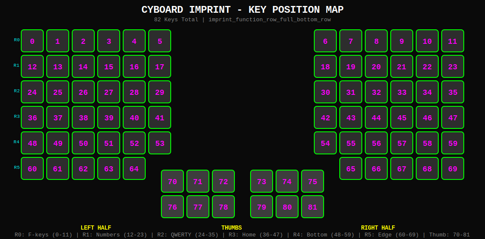
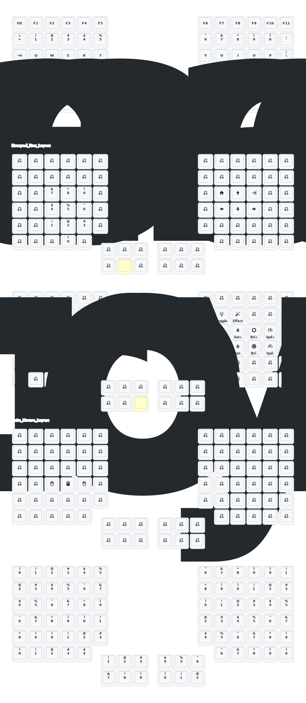

# Cyboard Imprint ZMK Configuration

Personal [ZMK](https://zmk.dev/) firmware configuration for the [Cyboard Imprint](https://cyboard.digital/) wireless split keyboard, built on the Assimilator-BT controller. Features home row mods, tap-dance, mod-morphs, and dual trackball support.

## Key Positions



## Keymap



## Layers

| Layer | Name | Activation | Description |
|-------|------|------------|-------------|
| 0 | BASE | Default | QWERTY with number row, home row mods (CTRL/ALT/GUI/SHIFT), tap-dance shift/caps lock, mouse buttons on upper right thumb |
| 1 | NUMBER | `num_lt` hold (right thumb) | Left-hand numpad (7-8-9 / 4-5-6 / 1-2-3), right-hand arrow navigation, bracket mod-morphs |
| 2 | FN | `mouse_lt_enter` hold (right thumb) | Bluetooth profile selection (5 slots + clear), function keys (F1-F13), RGB underglow toggle/effect, arrow navigation |
| 3 | MOUSELESS | `mouse_lt_enter` tap (right thumb) | Home row letter keys (ASDF/JKL;), macOS screenshot shortcuts, toggle exit |
| 4 | SYMBOLS | `fn_lt_enter` hold (right thumb) | Symbols (&*()$%^!@#), arrow navigation, bracket mod-morphs |

## Layout

```
Row 0 (pos 0-11):       transparent
Row 1 (pos 12-23):      ESC, number row (1-0), minus
Row 2 (pos 24-35):      TAB, QWERTY top row, =
Row 3 (pos 36-47):      home row with mods (ASDFG / HJKL;')
Row 4 (pos 48-59):      CTRL, ZXCVB / NM,./ backslash
Row 5 (pos 60-64 L):    transparent, LCTRL, LGUI, LALT, transparent
Row 5 (pos 65-69 R):    transparent, [{, ]}, `~, transparent
Row 6 (pos 70-72 L):    F1, F2, F12 (upper thumb)
Row 6 (pos 73-75 R):    Mouse L-click, Mouse R-click, F3 (upper thumb)
Row 7 (pos 76-78 L):    LALT, LGUI, SPACE (lower thumb)
Row 7 (pos 79-81 R):    ENTER/SYMBOLS, BSPC/NUMBER, MOUSE toggle (lower thumb)
```

## Features

- **Home row mods** -- CTRL/ALT/GUI/SHIFT on ASDF (left) and JKL; (right) via balanced hold-tap with 280ms tapping term, positional hold-trigger, and require-prior-idle
- **Tap-dance** -- single-tap for Shift, double-tap for Caps Lock
- **Mod-morphs** -- `{` / `[` and `}` / `]` toggled by holding Shift
- **Layer macros** -- `fn_layer_color` and `sym_layer_color` for momentary layer activation, `mouse_tog_enter`/`mouse_tog_exit` for toggling the mouse layer
- **Bluetooth** -- 5 profile slots (BT_SEL 0-4) and BT_CLR on the FN layer number row
- **Mouse buttons** -- left-click and right-click on upper right thumb cluster (pos 73-74)
- **RGB underglow** -- toggle and effect cycling on the FN layer
- **Dual trackballs** -- left trackball for scrolling (sensitivity 1/2, Y-inverted), right trackball for cursor movement
- **Split wireless** via Bluetooth (Assimilator-BT board)

## Trackball Configuration

The left trackball is configured as a scroll wheel:
- Sensitivity scaled to 1/2 via `zip_xy_scaler`
- Y-axis inverted so the view follows the trackball direction

The right trackball operates as a cursor with default settings. Auto-layer activation (layer 3 on movement) is commented out but ready to enable.

## Building

Firmware builds automatically via GitHub Actions on every push. The workflow produces separate firmware files for left and right halves.

To trigger a build manually, use the **Run workflow** button on the Actions tab.

## Keymap Diagram

The keymap SVG is auto-generated by [keymap-drawer](https://github.com/caksoylar/keymap-drawer) via GitHub Actions. It regenerates whenever files in `config/` or `keymap_drawer.config.yaml` change, and commits the updated diagram back to the repo.

## Resources

- [Cyboard Documentation](https://docs.cyboard.digital/)
- [ZMK Documentation](https://zmk.dev/docs)
- [ZMK Keycodes Reference](https://zmk.dev/docs/keymaps/list-of-keycodes)
- [Keymap Drawer](https://github.com/caksoylar/keymap-drawer)
